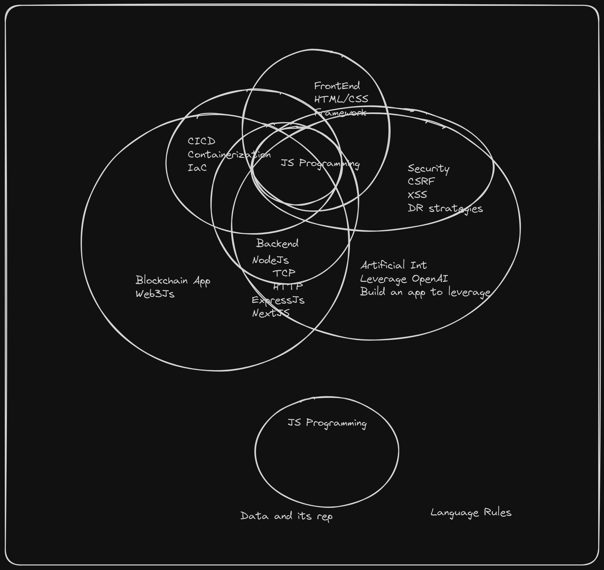
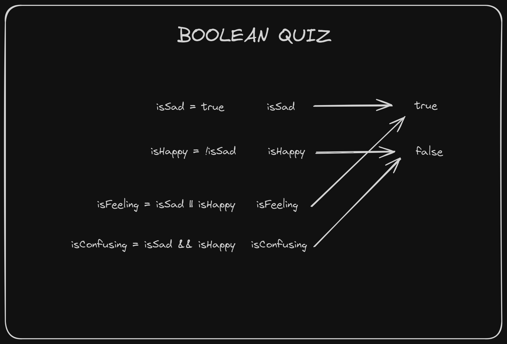

Session 04: Data types Part II
---

## Agenda today
- [x] Review any questions anyone has
- [x] Roughly review the journey, to re-establish where we are in the journey and why we're talking about data types
- [x] Quick review of last four primitive data types we talked about - maybe a quiz?
- [x] Remaining primitive data types: Boolean, Big Ints, Symbols
- [x] BREAK (10mins)
- [x] Introduction to Objects
- [ ] Introduction to Functions (I don't think we'll get here buh maybe)

## Review questions
- WAYN?
- Assignments channel?

## Review Journey


## Quiz to review previous primitive data types
We did a 'what will this print' quiz. Review your answers and reasoning before running the code.

```js
// Undefined, Null, Number, String
console.log("1. typeof undefined === 'undefined'", typeof undefined === 'undefined');
console.log("2. typeof null === 'null'", typeof null === 'null');
console.log("3. typeof NaN === 'NaN'", typeof NaN === 'NaN');
console.log("4. typeof null === 'object'", typeof null === 'object');
console.log("5. typeof NaN === 'number'", typeof NaN === 'number');
console.log("6. typeof '420' === 'number'", typeof '420' === 'number');
console.log("7. Number.isNaN('420')", Number.isNaN('420'));
console.log("8. typeof Number('420') === 'number'", typeof Number('420') === 'number');
console.log("9. typeof Number('It is high time') === 'number'", typeof Number('It is high time') === 'number');
console.log("10. typeof String(420) === 'number'", typeof String(420) === 'string');
```

## Primitive Data types part two (Boolean, BigInt & Symbol)

### Boolean
Like day and night, there are only two boolean values: true and false.

```js
console.log(typeof (true)); // "boolean"
console.log(typeof (false)); // "boolean"

// We can perform logical operations with them:
let isSad = true;
let isHappy = !isSad; // The opposite
// The Math rule of OR
// - All has to be false for the result to be false
// - Said another way, if one is true, the result is true
let isFeeling = isSad || isHappy; // Is at least one of them true?

// The Math rule of AND
// - All has to be true for the result to be true
// - Said another way, if one is false, the result is false
let isConfusing = isSad && isHappy; // Are both true?
```

#### Truthiness of values
The following are 'falsey' values in Node JS: undefined, null, NaN, 0, '', false.

Meaning the above 6 values evaluates to false:

```js
Boolean(undefined)// false
Boolean(null)// false
Boolean(NaN)// false
Boolean(0)// false
Boolean('')// false
Boolean(false)// false
```

Everything else is said to be 'truthy'; meaning they evaluate to true. Some of the examples we went through are:

```js
Boolean('undefined') // its a string not undefined, since it has quotes
Boolean(' '); // not an empty string; a string with a space character in it will be truthy
Boolean('false'); // its a string, not false, since it has quotes
Boolean(-1);
Boolean(420);
```

#### The story of the bang (!), and the bang bang (!!)
The `!` is used to mean `not`. So `!true`, will be `false` and `!false` will be `true`.
Layering on top of that is the double bangs - which would mean `not not`, welcome to the double negatives :P. So `!!true === true` and `!!false === false`.

Makes sense eh? What about triple bangs??? Try it out, you're on your own haha.

#### Quiz

```js
let isSad = true;
let isHappy = !isSad;
let isFeeling = isSad || isHappy;
let isConfusing = isSad && isHappy;

// Open a sketching app or take a piece of paper, and sketch out the variables, the values, and the arrows between them for the above snippet of code.
```
####> Hollup Do not scroll to the answer yet

&nbsp;

&nbsp;

&nbsp;

&nbsp;




**Note:**
`!!` could be a shorthand for `Boolean` casting.

```js
Boolean('whatever value') === !!'whatever value'
```

### BigInts
BigInts were only recently added to JavaScript, so you won’t see them used widely yet. If you use an older browser, they won’t work. Regular numbers can’t represent large integers with precision, so BigInts fill that gap (literally):

```js
const alot = 9007199254740991n; // Notice n at the end
console.log(alot + 1n); // 9007199254740992n
console.log(alot + 2n); // 9007199254740993n
console.log(alot + 3n); // 9007199254740994n
console.log(alot + 4n); // 9007199254740995n
console.log(alot + 5n); // 9007199254740996n
```


**Warning:**
Don't mix BigInts with numbers, you will get `TypeErrors`!

In JavaScript, precision matters, especially in financial calculations, so remember: no rounding errors allowed! While this is crucial for accuracy, it's important to note that handling extremely large numbers can be resource-intensive.

Ever wondered about the number of BigInts in our universe? According to the specification, BigInts have arbitrary precision. This implies that in the JavaScript world, BigInts are limitless – there's one for every integer that exists in mathematics.

This might seem unusual at first, but it's comparable to the concept of infinite integers in mathematics. If you find that concept a bit challenging, take a moment to think it over! The idea isn't so different when transferring it from the realm of math to the realm of JavaScript.

### Symbols
Symbols are a relatively recent addition to JavaScript.

```js
const somethingUniq = Symbol();
console.log(typeof (somethingUniq)); // "symbol"
```

Understanding the role and functionality of JavaScript Symbols can be complex, particularly without a deeper exploration into objects and properties. Therefore, we'll temporarily set aside the discussion on Symbols. Apologies to them for the delay!


**Note:**
Remember though that they are unique values. If you compare two symbols, they will never be equal:

```js
const anotherUniq = Symbol();
console.log(somethingUniq === anotherUniq); // false
```

## Introduction to Objects
At last, we got to objects! We didn't have the time to go too deep, but here are some things we discussed.

Objects include arrays, dates, RegExps, and other non-primitive values:

```js
console.log(typeof ({})); // "object"
console.log(typeof ([])); // "object"
console.log(typeof (new Date())); // "object"
console.log(typeof (/\d+/)); // "object"
console.log(typeof (Math)); // "object"
```

Unlike everything before, objects are not primitive values. This also means that by default, they’re mutable. We can access their properties with ``.` (dot notation) or `[]` (square bracket notation):

```js
const rapper = { name: 'Malicious' };
rapper.name = 'Malice'; // Dot notation
rapper['name'] = 'No Malice'; // Bracket notation

// Another example we did in class
const person = {};
person.name = 'Bode'; // dot notation
person['age'] = 26; // note that when you use [], a stringifyable value is expected within the bracket
person.'highSchool' = 'GCI' // Error - try it to know the exact error, is it syntax? is it runtime?
person[highSchool] = 'GCI' // Another error - is it syntax error or runtime error?
const highSchool = 'highSchool'
person[highSchool] = 'GCI' // why did this work?
const gotNuts = 2;
person[gotNuts] = 200; // What will this do?
console.log(person); // check your answers
```

### Next episode
There's still more snow to unpack with objects, we're going to continue our journey from there. Until then, stay kiddy.