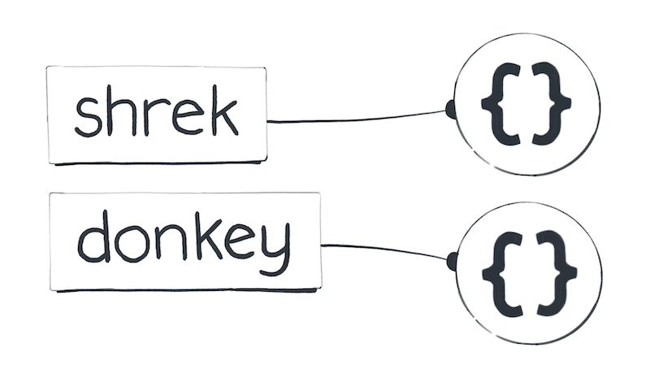

Review of Git And Introduction to JS Objects
---

## Review quiz
[Review Quiz](01_quiz_variables_prim.md)

## Review of git

Git: A version control system that lets you track changes in your code over time.

### Why versioning
- Ease of rollbacks
- Auditability of code
- Release versioning: clients could consume different versions of your software for example based on git branching
- Collaborative control

### Other systems
- Hg (Mercurial)
- SVN - Subversion
- TFS Project

GitHub: A hosting service for Git repositories, making it easier to collaborate with others. Other services (GitLab, Bitbucket)

**Git Basic Commands:**
  - git init: Initializes a new Git repository.
  - git status: Shows the status of changes as untracked, modified, or staged.
  - git log: Displays the entire commit history using the default format.
  - git clone: Copy a repository.
  - git add: Stage changes for commit.
  - git commit: Save your changes with a message.
  - git push: Upload local repository content to a remote repository.
  - git pull: Fetch and download content from a remote repository and immediately update the local repository to match that content.
  - git remote --help

  [Cheat Sheet](https://education.github.com/git-cheat-sheet-education.pdf)

  [Here is the git-demo repo we worked on in class](https://github.com/hafbau/git-demo)


## Creating Objects in JavaScript

### The Eternal Existence of Primitive Values

In JavaScript, there's a set of values we consider as the fundamentals - `null`, `undefined`, `booleans`, `numbers`, `bigints`, `symbols`, and `strings`. These are like the North Star in our coding sky; they're always present and unalterable. We don't create these values; rather, we summon them into our code. Here's an example to illustrate this:

```javascript
const sisters = 3;
const musketeers = 3;
// Both variables point to the same, constant number value
```


### The Unique Ability to Create Objects

Now, let's turn our attention to the fascinating world of objects. Unlike our primitive friends, objects in JavaScript are something we can create endlessly. Each time we use the `{}` notation, we're not just referencing an existing entity; we're actually creating a brand new object. Look at this:

```javascript
const shrek = {};
const donkey = {};
// Each variable holds a distinct object
```



This magic of creation extends to arrays, dates, and other object types as well. When we use `[]`, for instance, we're crafting a new array, a fresh construct that didn't exist before.

### Understanding the Life Cycle of Objects

A curious mind might wonder: do these objects we create stick around forever, or do they eventually disappear? In JavaScript, this aspect remains somewhat enigmatic. We can't explicitly destroy an object:

```javascript
let junk = {};
junk = null; // This doesn't necessarily annihilate the object
```


Instead, JavaScript operates on a principle known as garbage collection. This means that while we can't directly destroy an object, it might "disappear" if it becomes unreachable from our code. The specifics of when this happens are not determined by us and are usually not a concern unless you're delving into memory optimization.

## Next time
Today we took time to talk about git and review our quiz result. I included in this note, some re-introduction to JS objects creation and garbage collection to whet your appetite of what's to come. Next class we will take on more introduction to javascript objects. LFG!!!