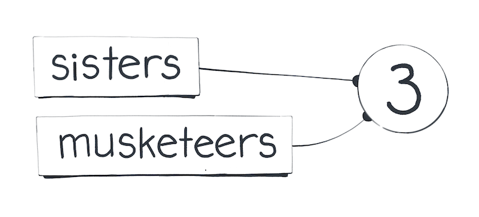
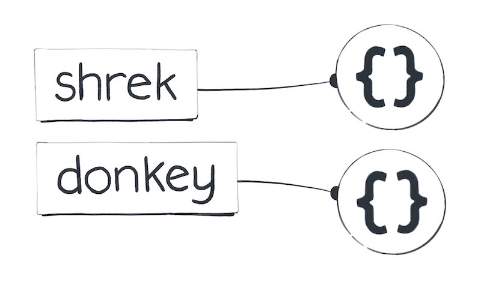
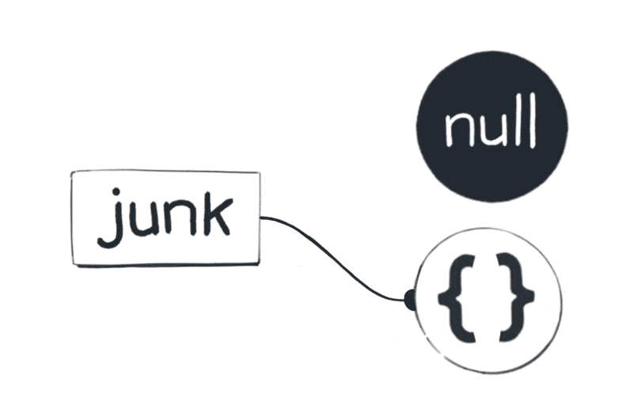
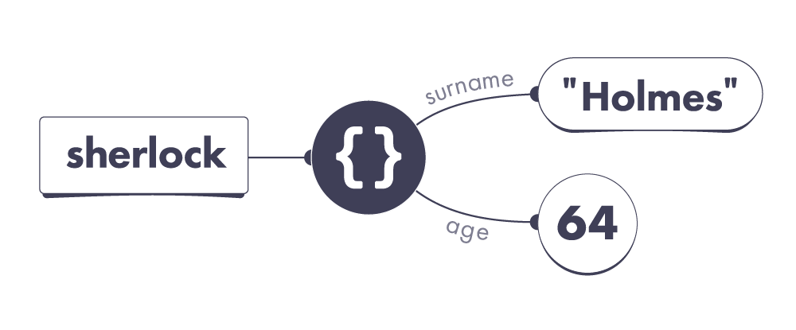
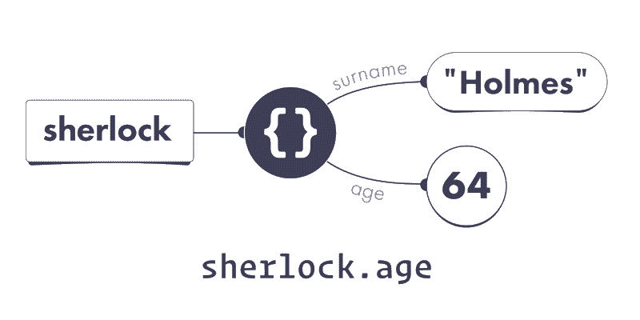

Introduction to Object Properties
---

## Agenda

- [x] Check-in on git
- [x] Creating Objects Literals
- [x] How to destroy a created object
- [x] Introduction to object properties
- [x] Property Names
[BREAK]
- [x] Reading a property
- [x] Assigning to a property
- [x] Missing Properties
- [x] Recap: Journey so far


## Checkin on git

1. How do I check if pwd (current working directory), is a git repository (is git enabled)

2. What are unstaged files?

3. Are unstaged files different from untracked files?

4. Diff between `git add .` vs `git add -A`

5. Why is `git status` so important?

BONUS: what is the point of a `.gitignore` file?


## Creating Objects in JavaScript

### The Eternal Existence of Primitive Values

In JavaScript, there's a set of values we consider as the fundamentals - `null`, `undefined`, `booleans`, `numbers`, `bigints`, `symbols`, and `strings`. These are like the North Star in our coding sky; they're always present and unalterable. We don't create these values; rather, we summon them into our code. Here's an example to illustrate this:

```javascript
// Both variables point to the same, constant number value
let sisters = 3;
let musketeers = 3;

// This question came up in class. In contrast to the above, what are we changing here?
let sisters = 5;
sisters = 7;
// It is important to note that 5 doesn't ever become 7, what we're changing is where our 'sisters' pointer points to. It used to point to 5, now it points to 7. We cannot create / change primitive values
```



### The Unique Ability to Create Objects

Now, let's turn our attention to the fascinating world of objects. Unlike our primitive friends, objects in JavaScript are something we can create endlessly. Each time we use the `{}` notation, we're not just referencing an existing entity; we're actually creating a brand new object. Look at this:

```javascript
const shrek = {};
const donkey = {};
// Each variable holds a distinct object
```



This magic of creation extends to arrays, dates, and other object types as well. When we use `[]`, for instance, we're crafting a new array, a fresh construct that didn't exist before.

### Understanding the Life Cycle of Objects

A curious mind might wonder: do these objects we create stick around forever, or do they eventually disappear? In JavaScript, this aspect remains somewhat enigmatic. We can't explicitly destroy an object:

```javascript
let junk = {};
junk = null; // This doesn't necessarily annihilate the object
```



Instead, JavaScript operates on a principle known as garbage collection. This means that while we can't directly destroy an object, it might "disappear" if it becomes unreachable from our code. The specifics of when this happens are not determined by us and are usually not a concern unless you're delving into memory optimization.

## Object Properties

Meet Sherlock Holmes, a world-renowned detective from London:

```javascript
let sherlock = {
  surname: 'Holmes',
  address: { city: 'London' } 
};
```

His friend John Watson has recently moved in to live with Sherlock:

```javascript
let john = {
  surname: 'Watson',
  address: sherlock.address
};
```

Sherlock is a brilliant detective but a difficult flatmate. One day, John decides he’s had enough. John changes his surname and moves to live in Malibu:

```javascript
john.surname = 'Lennon';
john.address.city = 'Malibu';
```

Time for a small exercise. Write down your answers to these questions:

```javascript
console.log(sherlock.surname); // ?
console.log(sherlock.address.city); // ?
console.log(john.surname); // ?
console.log(john.address.city); // ?
```

Before you scroll back up to re-read the code, I want you to approach it in a particular way. Open a sketch app or get paper and pen, and sketch out your mental model of what happens on every line. It’s okay if you’re not sure how to represent it. We haven’t yet discussed these topics so use your best guess.

Then, with the help of your final sketch, answer the four questions above.


> **Hollup! Wait a minute, answers are below
> &nbsp;
> &nbsp;
> &nbsp;
> &nbsp;
> &nbsp;
> &nbsp;
> &nbsp;
> &nbsp;
> &nbsp;
> &nbsp;
> Don’t scroll further until you have written the answers to four questions.
> &nbsp;
> &nbsp;
> &nbsp;

Now let’s check your answers:

```javascript
console.log(sherlock.surname); // "Holmes"
console.log(sherlock.address.city); // "Malibu"
console.log(john.surname); // "Lennon"
console.log(john.address.city); // "Malibu"
```

This is not a typo — they are indeed both in Malibu. It’s not so easy to get away from Sherlock! With a wrong mental model, one might conclude that sherlock.address.city is "London" — but it’s not.

To see why, we need to learn how properties work in our JavaScript universe.

### Properties

We’ve talked about objects before. For example, here is a sherlock variable pointing to an object value. We create a new object value by writing `{}`:

```javascript
const sherlock = {};
```

In our universe, it might look like this:


However, objects are primarily useful to group related data together. For example, we might want to group different things we know about Sherlock:

```javascript
let sherlock = {
  surname: 'Holmes',
  age: 64,
};
```

Here, sherlock is still a variable, but surname and age are not. They are properties. Unlike variables, properties belong to a particular object.


> ** In our JavaScript universe, both variables and properties act like "pointers".**
> However, the pointers of properties start from objects rather than from our code:



Here, we can see that the sherlock variable points to an object we have created. That object has two properties. Its surname property points to the "Holmes" string value, and its age property points to the 64 number value.

Importantly, properties don’t contain values — they point at them! It turns out that our universe is full of pointers. Some of them start in our code (variables), and others start from objects (properties). All pointers always point at values.

Before reading this, you might have imagined that values live “inside” objects because they appear “inside” them in code. This intuition often leads to mistakes, so we will be “thinking in pointers” instead. Take one more look at the code and the diagram. Make sure you’re comfortable with them before you continue.

### Property Names

Properties have names. A single object can’t have two properties with the same name. For example, our object can’t have two properties called age.

The property names are always case-sensitive! For example, age and Age would be two completely different properties from JavaScript’s point of view.

If we don’t know a property name ahead of time but we have it in code as a string value, we can use the [] “bracket notation” to read it from an object:

```javascript
let sherlock = { surname: 'Holmes', age: 64 };
let propertyName = prompt('What do you want to know?');
alert(sherlock[propertyName]); // Read property by its name
// the 'alert' line above won't work in your node repl; could you think of why?
```

Try this code in your browser console and enter age when prompted.

> **Note:** The `alert` is present in the browser's JS runtime but not in NodeJS runtime. The same way the `fs` lesson is present in NodeJS but absent in the browsers. Runtimes exposes what makes sense in corresponding environment - remember our vegetarian vs meat-eater metaphor.

## P A R T    T W O

### Reading a Property

We can read a property’s current value by using the “dot notation”:

```javascript
console.log(sherlock.age); // 64
```

Here, `sherlock.age` is our old friend — _an expression_, a question to the JavaScript universe. To answer it, JavaScript first follows the sherlock pointer:



It leads to an object. From that object, JavaScript follows the `age` property.

Our object’s age property points to `64`, so `sherlock.age` results in `64`.

### Assigning to a Property

What happens when we assign a value to a property?
```javascript
sherlock.age = 65;
```
Let’s split this code into the left and the right side, separated by =.

> First, we figure out which pointer is on the left side: `sherlock.age`.

We follow the sherlock pointer, and then pick the age property pointer:
Following the age property pointer on the left side

Note that we don’t follow the age pointer to 64. We don’t care what its current value is. On the left side of the assignment, we are looking for the pointer itself.

Remember which pointer we picked? Carry on.

Next, we figure out which value is on the right side: 65.

Unlike the left side, the right side of an assignment always expresses a value. In this example, the right side’s value is the number value 65. Let’s summon it:
Evaluating the right side: 65

Now we are ready to perform the assignment.

At last, we point the pointer on the left side to the value on the right side:
Changing the age property pointer to 65

And we’re done! From now on, reading sherlock.age would give us 65.

### Missing Properties

You might wonder what happens if we read a property that doesn't exist:

```javascript
let sherlock = { surname: 'Holmes', age: 64 };
console.log(sherlock.boat); // ?
```
We know that sherlock.boat is a property expression. The JavaScript universe follows certain rules to decide which value to “answer” us with.

These rules look roughly like this:

- Figure out the value of the part before the dot (.).
- If that value is null or undefined, throw an error immediately.
- Check whether a property with that name exists in our object.
  a. If it exists, answer with the value this property points to.
  b. If it doesn’t exist, answer with the undefined value.

Note these rules are a bit simplified, and we will need to amend them in the future lessons. Still, they already tell us a lot about how JavaScript works!

For example, sherlock points to an object that doesn’t have a boat property. So sherlock.boat gives us undefined as an answer:

```javascript
let sherlock = { surname: 'Holmes', age: 64 };
console.log(sherlock.boat); // undefined
```

Note this does not mean that our object has a boat property pointing to undefined! It only has two properties, and neither of them is called boat:

![Variable pointing at an object which points at other values via its properties]

It is tempting to think sherlock.boat directly corresponds to the concept of a property in our mental model, but that’s not quite correct. It is a question to the JavaScript engine — and so the engine follows the rules to answer it.

It looks at the object that sherlock points to, sees that it doesn’t have a boat property, and gives us back the undefined value because that’s what the rules say. There is no deeper reason to this: computers follow the rules.

Scroll up and re-read the rules again. Can you apply them in practice?

```javascript
let sherlock = { surname: 'Holmes', age: 64 };
console.log(sherlock.boat.name); // ?
```

What happens if we run this code? Don’t guess — follow the rules.

> Hint: there are two dots, so you need to follow the rules two times.


> **Hollup! Wait a minute, answers are below
> &nbsp;
> &nbsp;
> &nbsp;
> &nbsp;
> &nbsp;
> &nbsp;
> &nbsp;
> &nbsp;
> &nbsp;
> &nbsp;
> Don’t scroll further until you have the answer.
> &nbsp;
> &nbsp;
> &nbsp;

The answer is that calculating sherlock.boat.name throws an error:

- We need to first figure out the value of sherlock.boat.
- To do that, we need to figure out the value of sherlock.
- The pointer from sherlock variable leads to an object.
- Therefore, the value of sherlock is that object.
- An object is not null or undefined, so we keep going.
- That object does not have a boat property.
- Therefore, the value of sherlock.boat is undefined.
- We’ve got undefined on the left side of the dot (.).
The rules say that null or undefined on the left side is an error.

```javascript
let sherlock = { surname: 'Holmes', age: 64 };
console.log(sherlock.boat); // undefined
console.log(sherlock.boat.name); // TypeError!
```

If this still seems confusing, scroll up and mechanically follow the rules.

## Recap

- Properties are pointers — a bit like variables. They both point at values. Unlike variables, properties start from objects in our universe.
- Properties have names. Properties belong to particular objects. You can’t have more than one property with the same name on an object.
- Generally, you can perform an assignment in three steps:
  + Figure out which pointer is on the left.
  + Figure out which value is on the right.
  + Point that pointer to that value.
- An expression like obj.property is calculated in three steps:
  + Figure out which value is on the left.
  + If it’s null or undefined, throw an error.
  + If that property exists, the result is the value its pointer points to.
  + If that property doesn’t exist, the result is `undefined`.
Note that this mental model of properties is still a bit simplified. It is good enough for the next few lessons, but we will need to expand it in the future.

## Mystery solved??
If you got confused by the Sherlock Holmes example in the beginning, you can optionally get back to it and try to follow it with our new mental model. The next lesson will include a detailed walkthrough of it in case you’re still not quite sure why it works this way. Try to get used to seeing properties as pointers.
